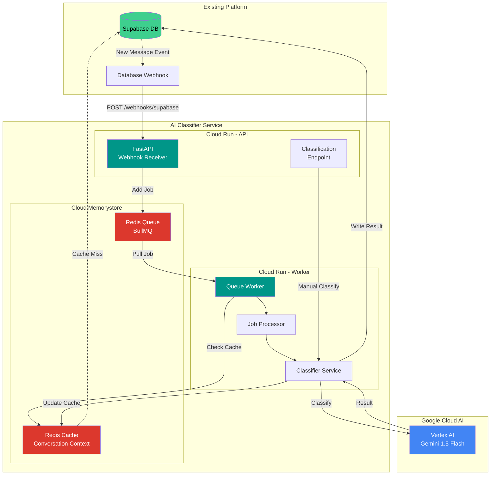
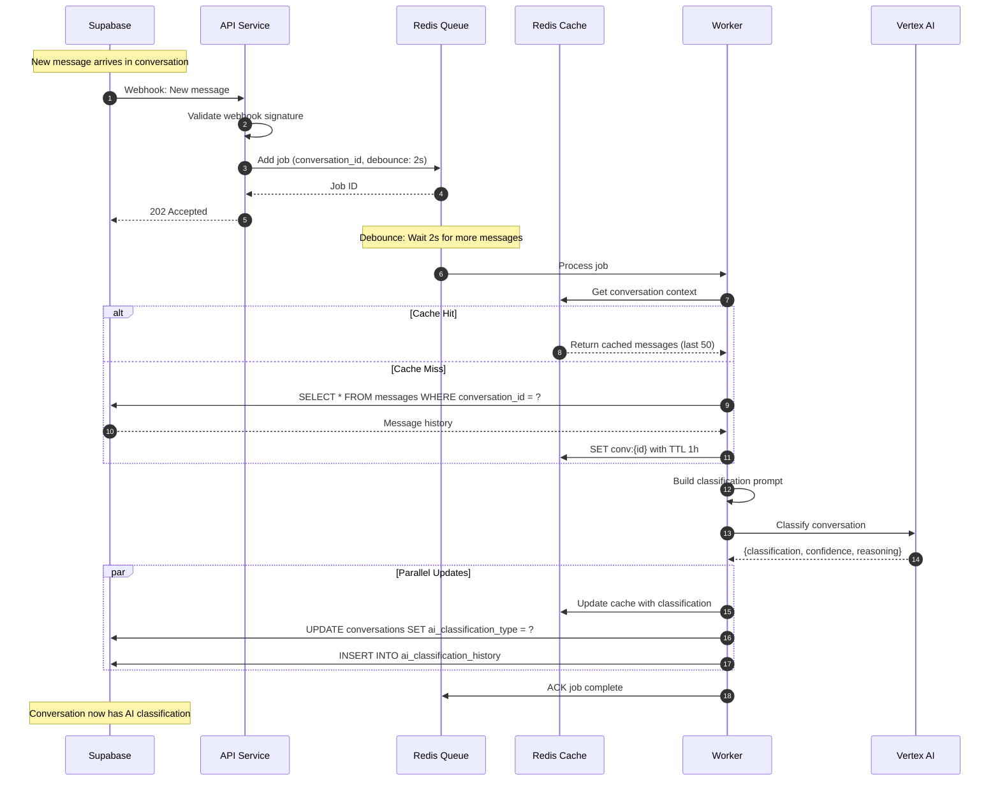
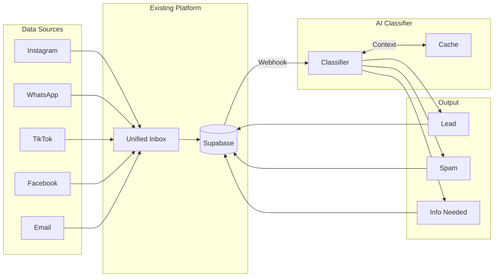
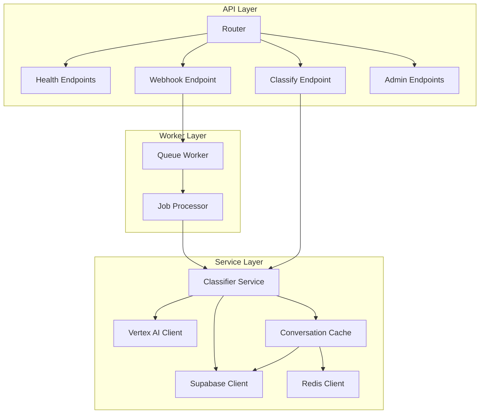
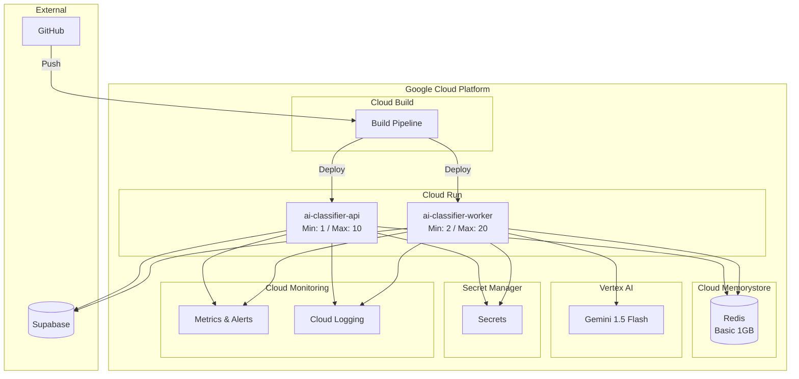
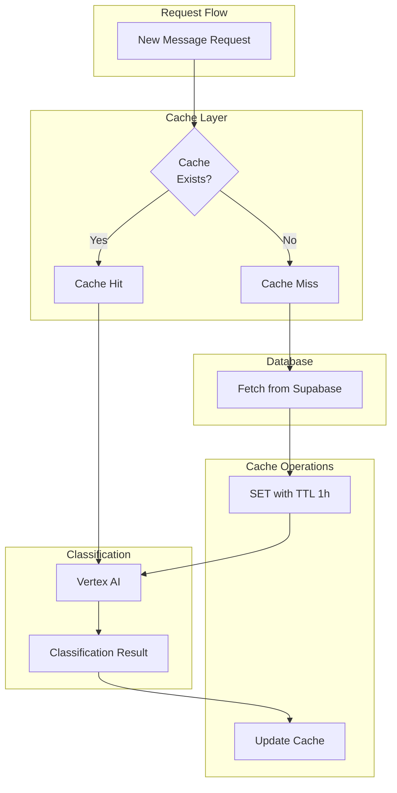
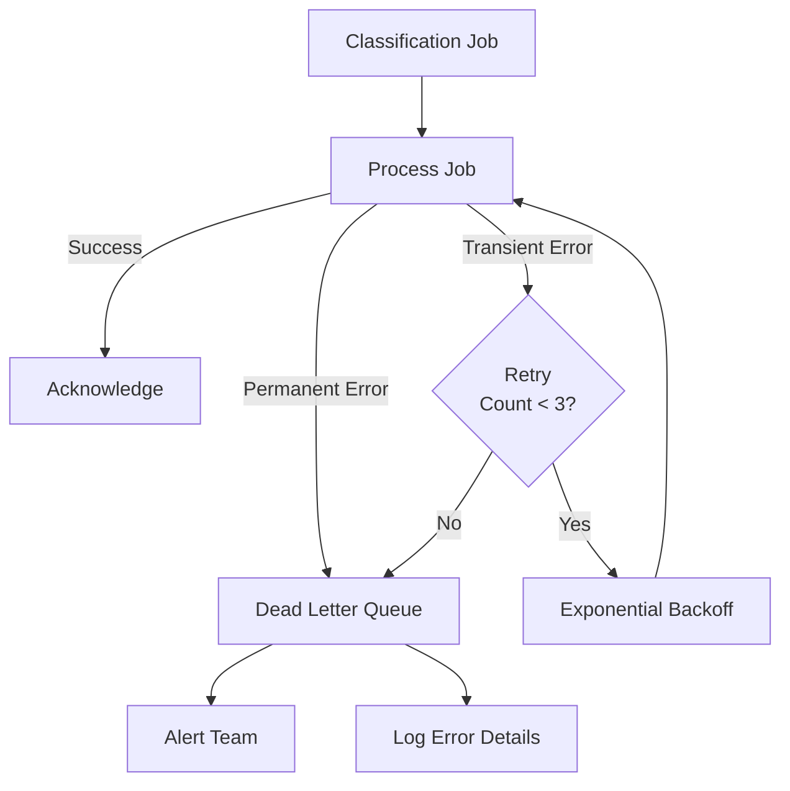
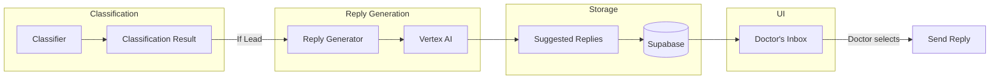
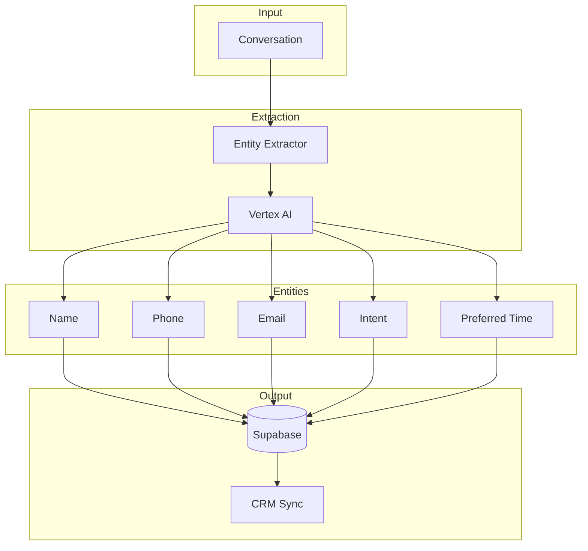

# AI Conversation Classifier - Architecture Diagrams

## System Architecture

---

## Classification Sequence Diagram

---

## Data Flow Diagram

---

## Component Diagram

---

## Deployment Architecture

---

## Cache Strategy Diagram

---

## Error Handling Flow

---

## Future: Auto-Reply Architecture

---

## Future: Data Extraction Pipeline

